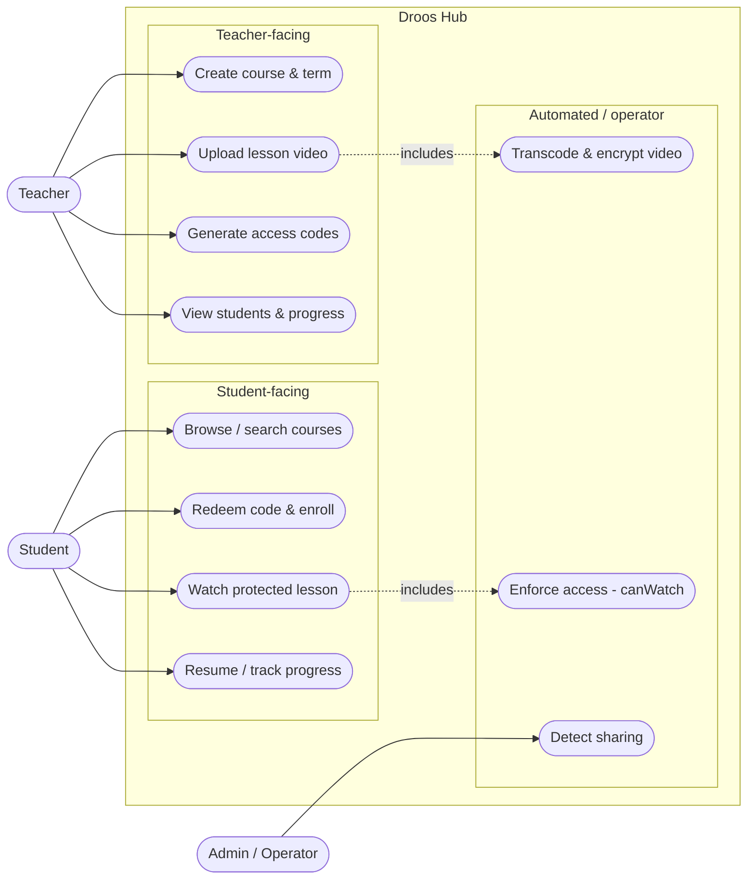

# Droos Hub — Pitch Prep

> Rehearse from this. Everything here is chosen to be **defensible under questioning** — judges probe, so we don't overclaim.

## The 30-second picture

**Droos Hub is a per-semester video platform that lets Egyptian school teachers sell and securely deliver their recorded lessons to students — protected against piracy, priced for the local market, and cheap enough to run that the economics actually work.**

- **Problem:** Teachers already sell lessons, but through WhatsApp / YouTube / USB. Paid content leaks instantly, there's no way to expire access per term, and no protection. They lose real money to sharing.
- **Solution:** Encrypted video delivery + per-semester access control, mobile-first and in Arabic, on a cost model that doesn't collapse as video traffic grows.
- **Why now / why us:** [your angle — teacher relationships, market knowledge, timing].

---

## Use-case diagram

*Three lanes: each actor touches only its own lane, so ownership is unambiguous. The dotted «include» arrows show the automated protection that fires during upload (transcode+encrypt) and playback (canWatch) — no human triggers those. Renders in VS Code's Markdown preview with a Mermaid extension, and on GitHub. Export to PNG for slides.*

---

## What's real vs. what's planned (know this cold — it's where judges push)

Be honest here. At this stage judges are betting on the *idea + market + your grasp of execution*, not a finished product. Owning the status calmly reads as competence; bluffing a demo you can't show reads as risk.

**Built / working:**
- Backend foundation: auth (signup/login, JWT), courses API, PostgreSQL schema (courses, lessons, videos, enrollments, devices), DB health-checks, unified validation + error handling.
- A concrete, sequenced build plan and a video-protection design doc — evidence you know *how* to ship this, not just what.

**Designed, not yet built (the next milestones):**
- Video pipeline (upload → transcode → encrypted delivery via Cloudflare R2).
- Access control (`canWatch`: enrolled + within the term's validity window + device limit).
- Frontend (currently a scaffold) and the mobile app.

**Framing line to use:** *"The foundation is in place — accounts, courses, the data model, deployment plan. Our next milestone is the secure video pipeline, which is the core of the product, and we've already designed it end-to-end."*

---

## What to promise (defensible) — and what NOT to

**Promise:**
- The **market**: a large, underserved base of teachers already selling lessons informally.
- The **execution path**: a phased plan to a pilot with one real teacher and 10–20 students in ~2–3 months.
- The **unit economics** (below) — this is your strongest, most concrete claim.
- **"Strong, traceable protection"** against casual piracy.

**Do NOT promise (these get you torn apart):**
- ❌ "Unbreakable DRM." No such thing — say *traceable deterrence*, which is honest and is the economically right bar.
- ❌ That it's built at scale or fully working. Overclaiming a demo you can't deliver is the fastest way to lose credibility.
- ❌ Extra features (live classes, quizzes, certificates, payment gateway). If asked, they're *roadmap*, deliberately deferred to stay focused.

---

## Your moat (say these two sentences)

1. **Economics:** *"We deliver video through Cloudflare R2, where storage is ~$0.015/GB and egress is free — so video traffic, the thing that bankrupts most video startups, doesn't scale our costs. One small server serves the whole pilot."*
2. **Protection:** *"Lessons are encrypted, keys are gated to enrolled devices, access expires with the semester, and every stream is watermarked — so sharing is deterred and traceable, without the cost of enterprise DRM."*

---

## Likely judge questions → honest answers

- **"What have you actually built?"** → Foundation: accounts, courses API, data model, deployment plan. Next milestone is the video pipeline (already designed).
- **"How do you stop piracy?"** → Encrypted HLS + gated keys + device cap + per-student watermark. Traceable deterrence, not an unbreakable vault — and that's the right economic trade-off.
- **"What does it cost to run?"** → R2 free egress is the lever; one cheap EU server handles the pilot. Cost per student stays low as we grow.
- **"How do you make money?"** → Teachers sell courses; we take a share. We start with redemption codes to avoid payment-gateway fees while validating demand.
- **"How will this scale?"** → Architecture is scale-ready by design (stateless API, video served off a CDN). We add capacity when demand proves we need it — not before.
- **"Why won't teachers just use YouTube/WhatsApp?"** → Those can't expire access per term, can't stop re-sharing, and don't handle payment. That's exactly the gap.

---

## The ask (close with something concrete)

*"We're 2–3 months from a live pilot with one teacher and their class. We're looking for [funding / mentorship / pilot teachers] to get there and prove the loop."*

---

*Assumptions baked in (correct me if off): Egyptian K-12 teacher market, redemption-code monetization to start, mobile-first students. All drawn from your own IMPLEMENTATION_PLAN.md and VIDEO_PROTECTION_GUIDE.md.*
